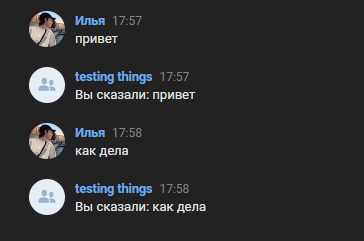

# VK bot with Spring boot
Бот, использующий Callback API. Копирует в ответ сообщение пользователя.\

# Как использовать
В applications.properties необходимо указать токен **(bot.token)** и ответ на сообщение сервера с типом "confirm" **(bot.confirm.code)**.
